# 🔮 Prophecy

**Prophecy** is a futuristic, cyberpunk-themed prediction market platform built on the Solana blockchain. It leverages a Council of AI Agents to autonomously research, judge, and resolve market outcomes, creating a trust-minimized betting experience.


## 🏗️ Architecture

The platform consists of three core pillars:

```mermaid
graph TD
    User[User] -->|Interacts| UI["Next.js Cyberpunk UI"]
    UI -->|Blinks/Actions| Solana["Solana Blockchain"]
    
    subgraph AI["AI Agent Council - LangGraph"]
        Researcher["🕵️ Researcher Node"] -->|Gemini 2.0| Web["Web Search"]
        Researcher -->|Facts| Judge["⚖️ Judge Node"]
        Judge -->|Decision| Executor["⚡ Executor Node"]
    end
    
    Executor -->|Resolve Market| Solana
```



## ✨ Key Features

### 1. 🤖 AI Agent Council
Powered by **LangGraph** and **Google Gemini 2.0 Flash**, our autonomous agent system resolves markets without human intervention.
- **Researcher Node**: Scours the web for real-time facts and context regarding the market question.
- **Judge Node**: Evaluates evidence logically to render a verdict (YES, NO, or UNCERTAIN).
- **Executor Node**: Interacts directly with the Solana blockchain to finalize markets on-chain.
- **Robustness**: Built-in rate limiting and exponential backoff to handle API constraints gracefully.

### 2. ⚡ Solana Smart Contracts
Built with **Anchor Framework** for high-speed, low-cost decentralized betting.
- **Market Creation**: Anyone can initialize a prediction market from a tweet URL.
- **Cred Staking**: Users stake Cred tokens on "Yes" or "No" outcomes.
- **Resolution**: Secure instruction for the Agent Council to settle bets.
- **Evidence Submission**: Human-in-the-loop evidence submission to influence AI decisions.
- **Market Disputes**: Users can dispute resolved markets if they disagree.

### 3. 🎨 Futuristic Frontend
An immersive **Next.js 15+** application designed with a "Cyberpunk Glassmorphism" aesthetic.
- **The War Room**: Real-time visualization of AI Council deliberations.
- **Blinks Integration**: Shareable betting widgets via Solana Actions.
- **Insight Pool**: AI-managed liquidity and market overview.
- **Leaderboard**: Top predictors ranked by Cred earnings.

### 4. 📡 Live Resolution Streams
Real-time WebSocket streaming for market resolutions.
- **Scheduled Resolutions**: Set a countdown timer for market resolution.
- **Live Logs**: Watch AI Council debate in real-time as it happens.
- **WebSocket Server**: Port 3002 for connecting frontend to agent streams.

## 🛠️ Tech Stack

| Layer | Technologies |
|-------|-------------|
| **Blockchain** | Solana, Anchor, Rust |
| **Agent Backend** | TypeScript, LangGraph, Google Gemini API, WebSocket |
| **Frontend** | Next.js 15, React, Tailwind CSS, Framer Motion |
| **Storage** | IPFS (via NFT.Storage) |
| **NFTs** | Metaplex (UMI) for Proof NFTs |

## 🚀 Getting Started

### Prerequisites
- Node.js v18+
- Rust & Cargo
- Solana CLI
- Anchor CLI
- Google Gemini API Key

### 1. Installation
Clone the repository and install dependencies.

```bash
git clone https://github.com/your-repo/prophecy.git
cd prophecy
npm install
```

### 2. Environment Setup
Create a `.env` file in the `agent` directory:

```env
GEMINI_API_KEY=your_google_gemini_api_key
RPC_URL=https://api.devnet.solana.com
AGENT_KEYPAIR_PATH=/path/to/your/keypair.json
```

### 3. Build & Deploy Smart Contracts
```bash
anchor build
anchor deploy --provider.cluster devnet
```

### 4. Running the Agent
The agent runs as a standalone service to monitor and resolve markets.

```bash
cd agent
npm install
npm run dev
```

This starts:
- **API Server**: http://localhost:3001
- **WebSocket Server**: ws://localhost:3002

### 5. Running the Frontend
Start the immersive web experience.

```bash
cd web
npm install
npm run dev
```

## 📡 API Endpoints

| Endpoint | Method | Description |
|----------|--------|-------------|
| `/logs` | GET | Get War Room logs |
| `/resolve` | POST | Trigger market resolution |
| `/evidence` | POST | Submit evidence for a market |
| `/reconsider` | POST | Request reconsideration with evidence |
| `/mint-nft` | POST | Mint Proof NFT for winning |
| `/faucet` | POST | Get test Cred (devnet) |
| `/schedule-resolution/:marketId` | POST | Schedule resolution with countdown |
| `/oracle-stakes/:marketId` | GET | Get oracle stakes for a market |
| `/health` | GET | Health check |

## 🔮 Future Improvements

- **Twitter/X Auto-Reply Bot**: Automatically create markets from Twitter mentions (requires paid API tier)
- **Multi-chain Support**: Expand beyond Solana
- **Advanced AI Models**: Integration with more sophisticated reasoning models
- **Governance**: DAO-based protocol governance using Cred tokens

## ⚠️ Notes

- The Agent uses **Gemini 2.0 Flash** via direct REST API calls for performance.
- Rate limits are handled automatically; `429 Resource exhausted` logs indicate quota waiting.
- Oracle Stakes require the updated smart contract to be deployed.
- WebSocket streaming requires the agent to be running locally.

## 📜 License

MIT License - See [LICENSE](LICENSE) for details.
